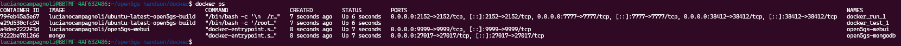
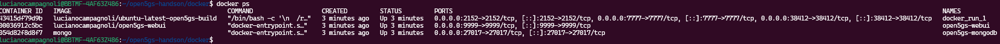

# open5gs-handson

Este repositório contém componentes do Open5GS e instruções para executá-los em máquina local.

## Inicialização

Para inicializar os componentes, migre para o diretório **docker** e execute:

```bash
docker-compose up -d
```

Caso as imagens não estejam instaladas no ambiente Docker do usuário, ele vai baixar as existentes (no caso do serviço do MongoDB) e realizar o **build** das necessárias (para os outros serviços). Após o processo, espera-se obter os seguintes serviços ao executar o comando **docker ps**:



Segue uma breve descrição dos contêineres em execução:

- **docker_run_1**: *core* da rede RAN 5G;
- **docker_test_1**: contêiner de teste das funcionalidades do *core* (finaliza depois de um certo tempo). Um exemplo de seus logs pode ser visto em [evidences/logs/test_log.txt](./evidences/log/test_log.txt)
- **open5gs-webui**: interface gráfica para gerenciamento e visualização dos componentes da rede;
- **open5gs-mongodb**: base de dados Mongo DB que persiste dados das funções de *core* da rede (e da qual a aplicação de interface gráfica também faz leituras)

Após a finalização do contêiner de teste, o comando **docker ps** retorna os outros três restantes:



A captura abaixo mostra exemplos de *logs* da instância MongoDB em funcionamento (após a execução do contêiner de teste):


A captura abaixo mostra *logs* do *core* em execução. O arquivo completo com os *logs* pode ser visualizado em [evidences/logs/core_log.txt](./evidences/log/core_log.txt)


Pode-se verificar a conectividade e exposição das funções de rede de dentro do contêiner com o comando **ss**, como mostrado na captura abaixo:


Para desativar os serviços em execução, execute, no diretório **docker**:

```bash
docker-compose down -d
```

Ao aplicar quaisquer mudanças em algum dos serviços, pode-se reiniciá-lo para refleti-las, executando:

```bash
docker-compose restart
```

